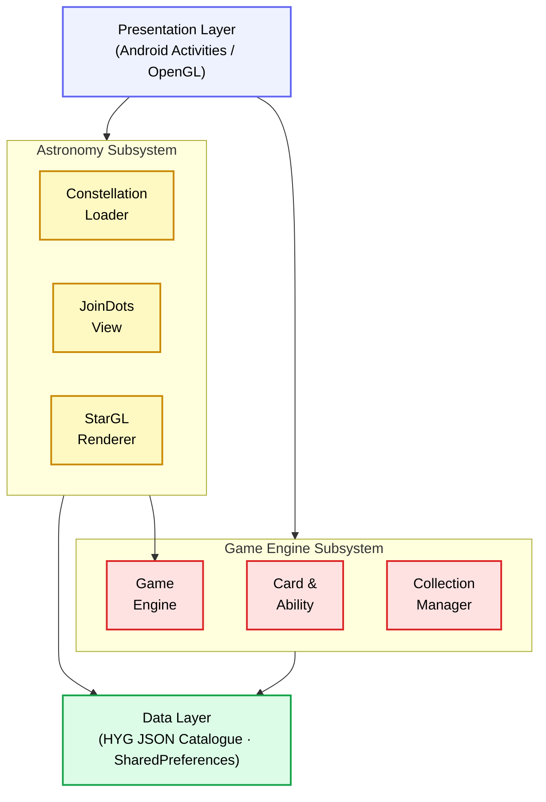
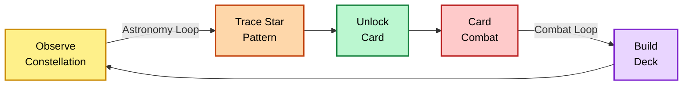
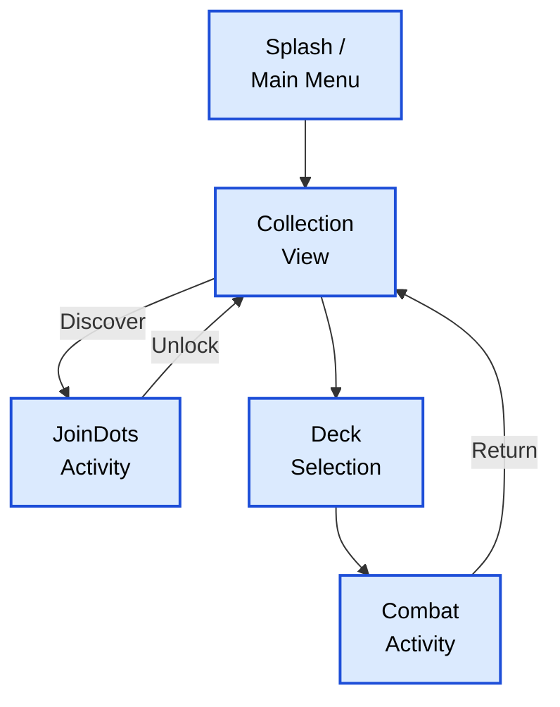

# Kepler: A Stellar Constellation Card Game

## 1. Project Idea & Vision
**Kepler** is an innovative Android application that seamlessly blends real-world astronomy with engaging card battler mechanics. Named in homage to the legendary astronomer Johannes Kepler, the project transforms the night sky into an interactive playground. 

The core premise is uniquely two-fold:
1. **Astronomy Education via Discovery**: Players "discover" and collect constellations by successfully tracing their real-world star mappings (using accurate Right Ascension and Declination coordinates from astronomical databases).
2. **Strategic Card Combat**: Once collected, these constellations become playable "Cards" in the user's library, each possessing thematic stats (Attack, Defense, Energy Cost) and elemental abilities (Poison, Shield, Dodge, Heal). Players then use these cards in turn-based combat against AI or multiplayer opponents.

## 2. The Novelty Aspect
What sets Kepler apart from traditional card-battlers (like Hearthstone or Slay the Spire) or stargazing apps (like Star Walk) is the **symbiosis of realistic scientific data and gamification**.

- **Scientific Gamification (The Collection Loop)**: Unlike standard games where cards are unlocked via loot boxes or currency, Kepler players must "earn" their cards by completing the `JoinDotsActivity`. The app uses actual data from the HYG (Hipparcos, Yale Bright Star, and Gliese) catalog. Stars are plotted dynamically onto a custom 2D canvas (`JoinDotsView`) based on their actual Right Ascension (RA), Declination (Dec), and apparent Magnitude (brightness). Players trace the lines between the stars, simultaneously learning the real shapes of the zodiac constellations.
- **Thematic Translation**: Celestial lore directly informs combat mechanics. For instance:
  - **Scorpius** utilizes *Venom Strike* to apply continuous Poison damage over time.
  - **Gemini** utilizes *Illusion Split* (Dodge) to evade incoming attacks, reflecting the twins' duality.
  - **Cancer** employs *Regenerate* (Heal) and *Shell Shield* for high defense.
- **Dynamic Energy System**: The turn-based combat engine features a progressive energy scaling system, forcing players to think strategically about when to use low-cost attacks versus saving up for high-impact abilities.

## 3. Current Implementation Details
The app is currently structured using native Android (Java) and features the following core components:

### A. The Astronomy Subsystem
- **`StarData` & `ConstellationLoader`**: Parses the `.json` datasets containing the trimmed HYG bright star catalog.
- **`JoinDotsActivity` & `JoinDotsView`**: Calculates relative coordinate translations to project spherical RA/Dec coordinates onto the device screen. Brighter stars (lower magnitude values) are rendered larger on screen. 
- **`StarGLSurfaceView` & `StarRenderer`**: Provides a beautiful, OpenGL-powered background rendering of starfields to create an immersive, space-themed user interface.

### B. The Game Engine & Combat Subsystem
- **`Card` & `Ability` Classes**: Defines the data structure for entities. Each constellation has base HP/ATK/DEF and configurable lists of Attack and Defense abilities. Abilities have distinct `Effects` (e.g., `POISON`, `SHIELD`, `HEAL`, `DODGE`, `IGNORE_DEF`).
- **`GameEngine`**: A robust, state-driven turn manager that handles player/AI turns, calculates energy accrual, applies status effects (like Poison ticks at the start of a turn), and computes damage modifiers (shields, temporary defense buffs).
- **`CollectionManager`**: Persists the player's unlocked constellations so they can be drawn into combat in future sessions.

---

## 4. Future Roadmap: The "Multi-Deck Card Game" Expansion
As the project evolves, the focus shifts toward transforming Kepler from a single-card dueling game into a deep, multi-deck strategic combat experience.

### Phase 1: Expansion of the Star Catalog
- **Broadened Horizons**: Integration of non-zodiac, globally recognized constellations (e.g., *Orion the Hunter*, *Ursa Major*, *Draco*) as ultra-powerful "Special Cards."
- **Astronomical Rarity System**: Rarity tiers (Common, Rare, Mythic) won't be arbitrarily assigned; they will be strictly governed by the **actual astronomical magnitude** of the stars within the constellation. A constellation forged from brilliantly bright, magnitude-0 stars will be inherently rarer and more powerful than one consisting of dim, magnitude-5 stars.

### Phase 2: Deck Building Mechanics
- **The "Deck of 5" System**: Transitioning combat from a 1v1 single-card view to a multifaceted 5-card deck environment.
- **Deck-Building Interface**: A dedicated GUI (`DeckSelectionActivity` expansion) allowing players to curate their loadouts based on synergies (e.g., stacking Defensive Water signs with Aggressive Fire signs).
- **Cosmic Passives**: Introduction of non-combatant "Passive" cards—such as specific Nebulae (e.g., *Orion Nebula*) or Galaxies (e.g., *Andromeda*)—that occupy dedicated slots to provide global deck-wide buffs (e.g., "+1 Energy per turn", "All Zodiacs gain +2 Defense").

### Phase 3: Combat Polish & Immersion
- **Elemental VFX**: Distinct particle systems and visual effects tied to astrological elements (Fire, Water, Earth, Air). Taurus's *Earth Slam* will crack the screen; Aries's *Horn Charge* will burst into flames.
- **Dynamic Action Animations**: Physical card animations such as violent shaking on critical hits, fading into transparency upon a successful *Dodge*, and persistent UI status icons indicating debuffs like Poison or buffs like Shield.
- **Audio-Visual Feedback**: Ensuring every strategic decision feels weighty, satisfying, and deeply tied to the cosmic theme.

## 5. System Architecture

## 6. Feature Comparison

| System | Real Star Catalog | Interactive Tracing | Card/Combat Engine | Data-Driven Rarity | Mobile (Android) | Lore-Based Abilities |
| :--- | :---: | :---: | :---: | :---: | :---: | :---: |
| Stellarium Mobile | ✅ | ❌ | ❌ | ❌ | ✅ | ❌ |
| Star Walk 2 | ✅ | ❌ | ❌ | ❌ | ✅ | ❌ |
| Sky Academy | ❌ | ❌ | ❌ | ❌ | ✅ | ❌ |
| Astromania | ❌ | ❌ | ✅ | ❌ | ❌ | ❌ |
| Trace the Stars | ❌ | ✅ | ❌ | ❌ | ❌ | ❌ |
| Stormbound | ❌ | ❌ | ✅ | ❌ | ✅ | ❌ |
| Hearthstone | ❌ | ❌ | ✅ | ❌ | ✅ | ❌ |
| **Kepler (Ours)** | ✅ | ✅ | ✅ | ✅ | ✅ | ✅ |

## 7. Engagement & Activity Flow

### Kepler's Dual Engagement Loop
*The outer astronomy loop gates card acquisition; the inner combat loop drives strategic play.*

### Application Activity Navigation

