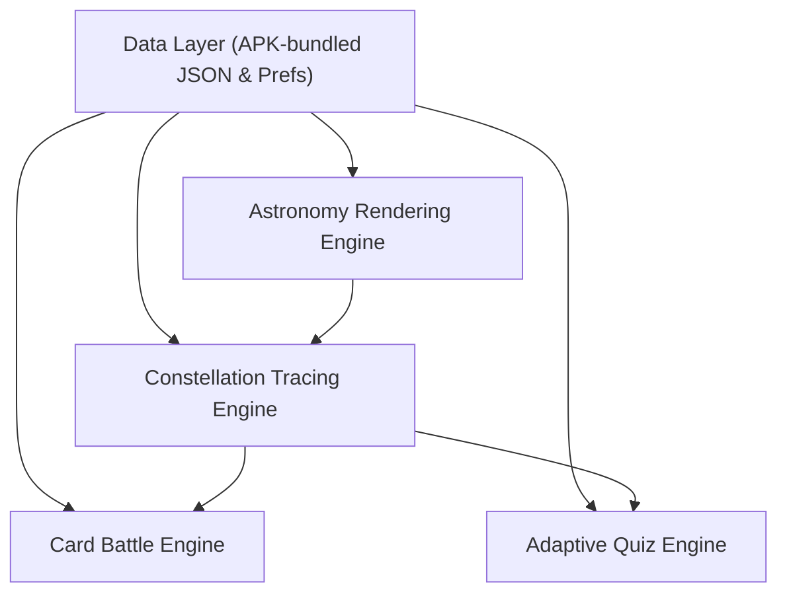
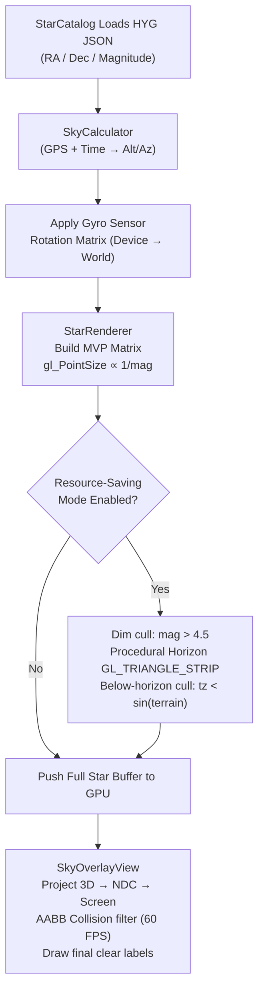
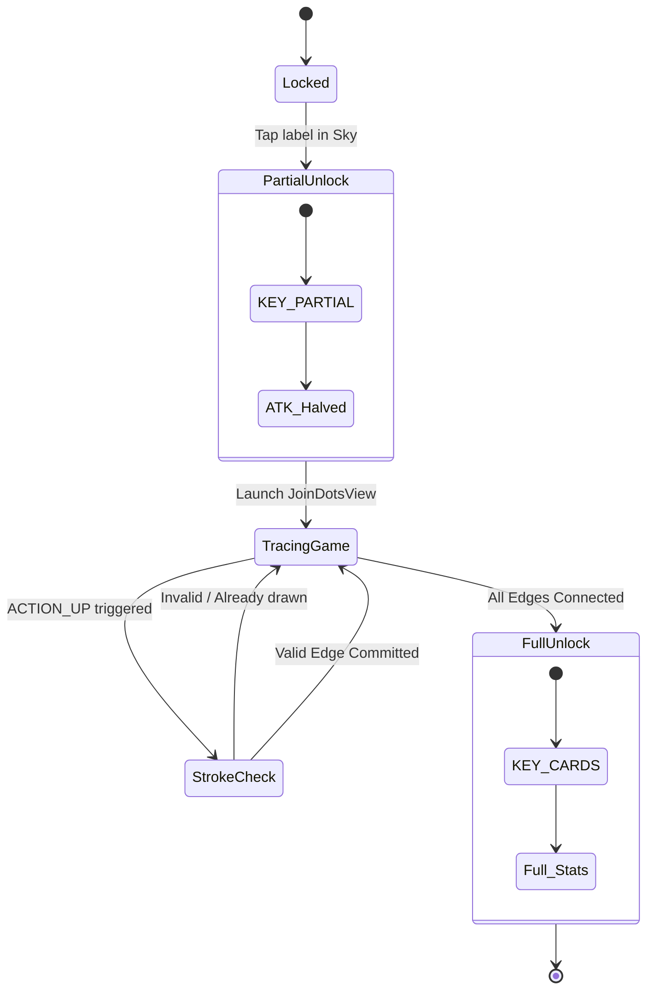
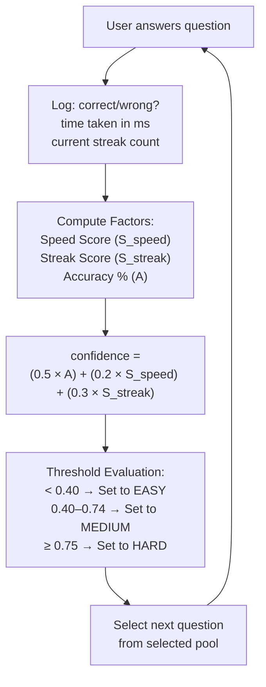
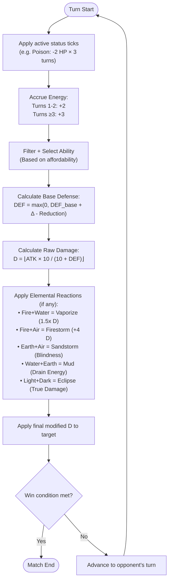
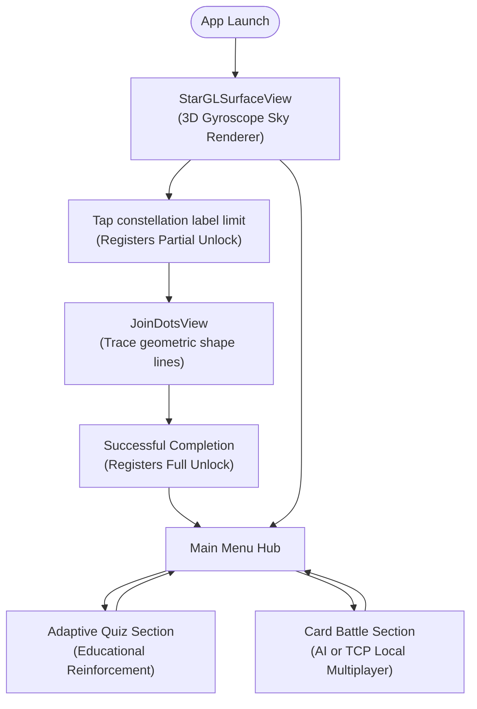

I'll analyze the existing LaTeX report and the PROJECT_OVERVIEW.md carefully, then produce only the sections that need surgical improvement, plus the Mermaid diagrams.

---

# PART 1: Updated LaTeX Sections

Here are only the sections that need modification. Replace each corresponding section in the current `.tex` file.

---

## Abstract (minor update to reflect full implemented feature set)

```latex
\begin{abstract}
We present \textit{Kepler}, an Android-based mobile application that integrates real-world astronomical data with a strategic card battle game engine. Named in honour of the astronomer Johannes Kepler, the system bridges the gap between educational stargazing tools and engaging card-battler games through four tightly coupled subsystems: (1) a physics-accurate 3D star renderer driven by the HYG stellar catalogue and device gyroscope orientation; (2) a touch-based constellation tracing system (\texttt{JoinDotsView}) that gates card acquisition behind verified geometric interaction with real star patterns; (3) a telemetry-driven adaptive quiz engine that adjusts difficulty without remote inference; and (4) a turn-based card battle engine supporting both AI and local TCP multiplayer, with elemental reaction mechanics and status effects. Each unlocked card carries combat attributes and elemental abilities derived from classical celestial lore. Kepler demonstrates that scientifically accurate data can serve as a compelling, non-arbitrary foundation for game mechanics, offering a replicable model for educational gamification in mobile applications.
\end{abstract}
```

---

## Section III: Game Design Rationale (replace fully)

```latex
\section{Game Design Rationale}
\label{sec:design}

\subsection{The Dual-Loop Design}
Kepler is structured around two interlocking engagement loops, illustrated in Fig.~\ref{fig:dual_loop}.

% FIGURE PLACEHOLDER: Dual Engagement Loop

\begin{figure}[h]
    \centering
    \includegraphics[width=0.8\linewidth]{engagement.png}
    \caption{Kepler's dual engagement loop. The outer astronomy loop gates card acquisition; the inner combat loop drives strategic play.}
    \label{fig:dual_loop}
\end{figure}

The \textit{outer loop} (Astronomy Loop) requires the player to locate a target constellation in an accurate 3D night sky, physically trace its canonical star-to-star connections on the \texttt{JoinDotsView} canvas, and thereby earn a full card unlock. The \textit{inner loop} (Combat Loop) uses the player's accumulated card library to engage in strategic turn-based combat, with elemental reactions, status effects, and an energy economy. This structure ensures that every card in the player's deck is a direct consequence of a verified astronomical interaction, not a random drop or currency purchase.

\subsection{Constellation Tracing as an Educational Mechanic}
Physical tracing of a constellation's skeletal geometry was chosen over tap-to-unlock or quiz-gated designs because it encodes spatial memory of the constellation's shape. A player who has dragged a path from Scorpius' head to its curved tail retains that morphology more durably than one who selected a correct multiple-choice answer. The mechanic is additionally gated: tapping a constellation in the sky renderer grants only a \textit{Partial Unlock} (reduced card power); completing the full trace escalates it to a \textit{Full Unlock}, preserving a meaningful incentive gradient.

\subsection{Thematic Translation of Celestial Lore}
A core design principle of Kepler is that no mechanic is arbitrary. Each constellation's combat identity is derived from its mythological and astronomical heritage. Table~\ref{tab:cards} enumerates the current zodiac card roster, elements, and signature abilities.

\begin{table}[htbp]
\caption{Zodiac Constellation Cards and Thematic Abilities}
\label{tab:cards}
\centering
\renewcommand{\arraystretch}{1.2}
\begin{tabular}{@{}lllcc@{}}
\toprule
\textbf{Constellation} & \textbf{Element} & \textbf{Signature Ability} & \textbf{ATK} & \textbf{DEF} \\
\midrule
Aries        & Fire  & Horn Charge      & 8 & 4 \\
Taurus       & Earth & Earth Slam       & 7 & 6 \\
Gemini       & Air   & Illusion Split   & 5 & 5 \\
Cancer       & Water & Shell Shield     & 3 & 9 \\
Leo          & Fire  & Solar Roar       & 9 & 3 \\
Virgo        & Earth & Harvest Mend     & 5 & 6 \\
Libra        & Air   & Scales of Equity & 6 & 6 \\
Scorpius     & Water & Venom Strike     & 8 & 4 \\
Sagittarius  & Fire  & Archer's Mark    & 9 & 2 \\
Capricorn    & Earth & Granite Bastion  & 4 & 8 \\
Aquarius     & Water & Tidal Surge      & 6 & 5 \\
Pisces       & Water & Regenerate       & 4 & 7 \\
\bottomrule
\end{tabular}
\end{table}

\noindent Elemental families map to distinct effect classes: Fire inflicts burst damage; Earth provides persistent defensive buffs; Water applies healing or poison-over-time; Air grants evasion or debuff effects. Five elemental \textit{reaction} pairs produce compound outcomes—for instance, Fire $+$ Water triggers \textit{Vaporize} (1.5$\times$ damage multiplier), while Earth $+$ Air triggers \textit{Sandstorm} (inflicts temporary blindness via \texttt{dodgeNext}). These reactions add a layer of strategic synergy absent from flat-element systems.

\subsection{Adaptive Quiz as Educational Reinforcement}
The adaptive quiz reinforces lore and scientific facts about constellations already encountered in the astronomy loop. A lightweight heuristic engine—requiring no network inference or ML model—adjusts question difficulty in real time based on three telemetry signals: answer accuracy, response speed, and answer streak. This design choice prioritises universal accessibility: the engine runs entirely on-device, with no cold-start latency and no dependency on network availability.

\subsection{Energy Economy}
Combat employs a progressive energy system. Players begin a match with 0 Energy. The first two turns each generate 2 Energy; from turn 3 onward, generation increases to 3 Energy per turn, capped at 10. Low-cost abilities (1--2 Energy) are available immediately; high-impact abilities (4--6 Energy) require deliberate saving, introducing a temporal planning dimension absent in flat-resource systems.
```

---

## Section IV: System Architecture (replace fully)

```latex
\section{System Architecture}
\label{sec:architecture}

% FIGURE PLACEHOLDER: System Architecture Diagram

\begin{figure}[h]
    \centering
    \includegraphics[width=0.8\linewidth]{architecture.png}
    \caption{High-level architecture of Kepler, showing the four principal subsystems and their interactions.}
    \label{fig:architecture}
\end{figure}

Kepler's architecture is divided into four principal subsystems: the Astronomy Rendering Engine, the Constellation Unlock System, the Adaptive Quiz Engine, and the Card Battle Engine. All subsystems share a common Data Layer and Persistence System, described below.

\subsection{Astronomy Rendering Subsystem}

\textbf{Star Rendering Pipeline.}
\texttt{StarCatalog.java} loads statically bundled star data from the HYG catalogue, exposing per-star 3D vertices, RA/Dec coordinates, and apparent visual magnitude. \texttt{StarRenderer.java} draws each star as an OpenGL ES 2.0 \texttt{GL\_POINTS} primitive; \texttt{gl\_PointSize} is computed inversely proportional to magnitude so that brighter stars render as larger points. The Model-View-Projection (MVP) matrix is updated each frame from device orientation data, binding the gyroscope sensor's rotation matrix (transformed from device space to world space) directly to the GL thread.

\textbf{Topocentric Coordinate Conversion.}
\texttt{SkyCalculator.java} converts static equatorial coordinates (RA/Dec) to dynamic topocentric altitude/azimuth using the user's geographic location (latitude/longitude) and system time. This ensures stars appear at physically correct positions for the user's actual sky.

\textbf{Label Rendering (\texttt{SkyOverlayView}).}
A transparent Android \texttt{View} is composited above the \texttt{GLSurfaceView}. \texttt{StarRenderer} projects each star's 3D world vector through the current MVP matrix to obtain Normalized Device Coordinates, which are then converted to 2D screen positions. Labels are sorted by magnitude priority (constellation centroids bypass this and receive highest priority). An AABB collision check using \texttt{RectF.intersects} discards incoming labels whose bounding boxes overlap already-drawn ones, preventing visual clutter at 60 FPS without external libraries.

\textbf{Resource-Saving Mode.}
When enabled, three optimisations activate: (1) \textit{Dim-star culling}---stars with magnitude $> 4.5$ are excluded from the render buffer before GPU upload; (2) \textit{Horizon culling}---a procedural terrain altitude is computed as a composite sine/cosine wave over the local azimuth angle, rendered as a \texttt{GL\_TRIANGLE\_STRIP} ground mesh with a \texttt{GL\_LINE\_STRIP} horizon glow; (3) \textit{Below-horizon culling}---stars whose transformed $z$-coordinate satisfies $t_z < \sin(\phi_{\text{terrain}}(\theta))$, where $\theta$ is the viewing azimuth, are skipped during vertex loading.

% FIGURE PLACEHOLDER: Star Rendering Pipeline

\subsection{Constellation Unlock Subsystem}

\texttt{JoinDotsView.java} implements the tracing mechanic. On \texttt{ACTION\_DOWN} and \texttt{ACTION\_MOVE}, a Euclidean nearest-neighbour search with radius 80\,px snaps the touch cursor to the closest \texttt{StarPoint}. A real-time clipping mask (\texttt{Path.addCircle}) renders a 2.5$\times$ magnifier 250\,px above the touch point, preserving visibility of fine star connections as the user's finger occludes the screen. On \texttt{ACTION\_UP}, the engine validates whether the stroke connects a pair of \texttt{StarPoint} nodes matching an undrawn \texttt{targetLine}; valid connections are committed and snapped visually. Completion is triggered when \texttt{drawnLines.size() $\geq$ targetLines.size()}.

\textbf{Partial vs.\ Full Unlock.}
\texttt{CollectionManager.java} maintains two unlock states per constellation via \texttt{SharedPreferences}: \texttt{KEY\_PARTIAL} (awarded on first tap in the sky renderer) and \texttt{KEY\_CARDS} (awarded on successful trace completion). Cards in partial-unlock state are subjected to \texttt{getWeakenedCard()}, which halves all offensive statistics, preserving a meaningful power incentive for completing the trace.

% FIGURE PLACEHOLDER: Constellation Tracing State Flow

\subsection{Adaptive Quiz Subsystem}

\texttt{QuizManager.java} parses \texttt{quiz\_questions.json} into Easy, Medium, and Hard question pools, shuffled on load. \texttt{DifficultyManager.java} computes a \texttt{confidenceScore} after each answer from three real-time telemetry signals:

\begin{align}
  S_{\text{speed}} &= 1.0 - \frac{\max(0,\; \bar{t} - 3000)}{7000} \label{eq:speed}\\
  S_{\text{streak}} &= \min\!\left(1,\; \frac{k}{5}\right) \label{eq:streak}\\
  \text{confidence} &= 0.5 \cdot A + 0.2 \cdot S_{\text{speed}} + 0.3 \cdot S_{\text{streak}} \label{eq:confidence}
\end{align}

\noindent where $A$ is the cumulative accuracy ratio, $\bar{t}$ is the mean response time in milliseconds, and $k$ is the current consecutive-correct streak. Difficulty transitions occur at: $\text{confidence} < 0.40 \Rightarrow$ \textsc{Easy}; $0.40 \leq \text{confidence} < 0.75 \Rightarrow$ \textsc{Medium}; $\text{confidence} \geq 0.75 \Rightarrow$ \textsc{Hard}. The engine is entirely on-device, requiring no network calls or bundled ML models.

% FIGURE PLACEHOLDER: Adaptive Quiz Difficulty Flow

\subsection{Card Battle Subsystem}

\textbf{Data Model.}
Each \texttt{Card} object holds base HP, ATK, DEF, Energy Cost, and two ordered \texttt{Ability} lists (offensive and defensive). Each \texttt{Ability} encapsulates an \texttt{Effect} enum (\texttt{POISON}, \texttt{SHIELD}, \texttt{HEAL}, \texttt{DODGE}, \texttt{IGNORE\_DEF}, \texttt{BURNING}), a magnitude, and a duration for persistent effects.

\textbf{Combat Damage Formula.}
\begin{equation}
  D = \max\!\left(1,\; \left\lfloor \left(\text{ATK}_{\text{base}} + \Delta_{\text{bonus}} + \Delta_{\text{ability}}\right) \cdot \frac{10}{10 + \text{DEF}_{\text{eff}}} \cdot \delta_{\text{shield}} \right\rfloor \right)
\end{equation}
where $\text{DEF}_{\text{eff}} = \max(0, \text{DEF}_{\text{base}} + \Delta_{\text{def}} - R_{\text{reduction}})$, $\delta_{\text{shield}} = 0.5$ if the defender holds an active shield (otherwise 1.0), and $\text{DEF}_{\text{eff}} = 0$ when the ability carries \texttt{IGNORE\_DEF}.

\textbf{Elemental Reactions.}
Five reaction pairs modify combat outcomes beyond the base formula:
\begin{itemize}
  \item \textit{Fire $+$ Water} $\Rightarrow$ \textbf{Vaporize}: $D \mathrel{\times}= 1.5$
  \item \textit{Earth $+$ Air} $\Rightarrow$ \textbf{Sandstorm}: grants defender \texttt{dodgeNext = true} (temporary blindness)
  \item \textit{Water $+$ Earth} $\Rightarrow$ \textbf{Mud}: drains 1 energy from defender, refunds to attacker
  \item \textit{Fire $+$ Air} $\Rightarrow$ \textbf{Firestorm}: $D \mathrel{+}= 4$ (flat)
  \item \textit{Light $+$ Dark} $\Rightarrow$ \textbf{Eclipse}: $D = \text{ATK}_{\text{total}}$ (true damage, bypasses all DEF)
\end{itemize}

\textbf{Defensive Cleansing.}
Casting a Water or Earth defensive ability tests for active DoT debuffs (\texttt{BURNING}, \texttt{DRENCHED}). A successful cleanse strips the debuff and refunds 1 HP, creating reactive interdependency between status effects and element choice.

\textbf{Turn Lifecycle.}

% FIGURE PLACEHOLDER: Combat Engine Turn Lifecycle

\begin{enumerate}
  \item Apply start-of-turn status ticks (Poison: $-2$ HP for 3 turns).
  \item Accrue energy: turns 1--2 generate 2 Energy; turns $\geq 3$ generate 3 Energy; cap at 10.
  \item Filter and present affordable abilities.
  \item Execute selected ability; compute elemental reaction if applicable; apply damage.
  \item Check win condition; advance turn.
\end{enumerate}

\textbf{Multiplayer Architecture.}
\texttt{GameSocketManager.java} implements local TCP multiplayer. The host opens a \texttt{ServerSocket} on port 8888; the opponent connects via a direct TCP \texttt{Socket} to the host IP. Send and receive streams (\texttt{PrintWriter}/\texttt{BufferedReader}) run on dedicated \texttt{ExecutorService} threads, pushing resolved game states exclusively through \texttt{Handler(Looper.getMainLooper())} to avoid UI-thread blocking.

\subsection{Data Layer and Persistence}
All astronomical data is bundled as pre-processed JSON assets within the APK, eliminating runtime network dependency. \texttt{CollectionManager.java} serialises card unlock states to \texttt{SharedPreferences} as JSON, enabling session-persistent progress without a database dependency. Quiz questions are similarly bundled in \texttt{quiz\_questions.json} and loaded into memory at quiz initialisation.
```

---

## Section V: Implementation (replace fully)

```latex
\section{Implementation}
\label{sec:implementation}

\subsection{Platform and Language}
Kepler is implemented in native Android Java (API level 26+), targeting Android 8.0 Oreo and above. Native Java was chosen over cross-platform frameworks (Flutter, React Native) to enable direct \texttt{GLSurfaceView} control for OpenGL ES 2.0 rendering, low-level \texttt{Canvas} drawing in \texttt{JoinDotsView}, and raw \texttt{Sensor} matrix access for gyroscope-to-MVP binding.

\subsection{Coordinate Projection in JoinDotsView}
The gnomonic projection in \texttt{JoinDotsView} maps each star at equatorial coordinates $(\alpha, \delta)$ to 2D canvas pixels via:
\begin{align}
  x &= \tfrac{W}{2} + s \cdot (\alpha - \alpha_0)\cos\delta_0 \\
  y &= \tfrac{H}{2} - s \cdot (\delta - \delta_0)
\end{align}
where $(\alpha_0, \delta_0)$ is the constellation's mean RA/Dec, $s$ is a pixels-per-degree scale factor, and $W \times H$ is the canvas resolution. This linear approximation holds for angular extents $< 30°$, which covers all individual IAU constellation asterisms.

\subsection{Star Brightness Scaling}
Rendered point size in \texttt{StarRenderer} scales as $r = r_{\max} - k \cdot m$, where $m$ is the star's apparent visual magnitude and $k$ is a device-resolution calibration constant. Stars with $m > 4.5$ are culled from the vertex buffer in Resource-Saving Mode before GPU upload, reducing geometry load without altering the visual hierarchy of bright stars.

\subsection{Topocentric Mapping}
\texttt{SkyCalculator.java} converts catalogue RA/Dec to local altitude/azimuth using the device's GPS latitude/longitude and system clock, computing the Local Sidereal Time and applying the standard equatorial-to-horizontal rotation. The resulting altitude/azimuth vector drives the MVP matrix orientation each render frame via the gyroscope rotation matrix, binding real celestial positions to physical device orientation.

\subsection{Gesture Validation for Constellation Tracing}
\texttt{JoinDotsView} captures touch events and snaps the cursor to the nearest \texttt{StarPoint} within 80\,px (Euclidean). A stroke from node $S_i$ to node $S_j$ is committed as a valid edge if and only if $(S_i, S_j)$ appears in the \texttt{targetLines} set and has not yet been drawn. The magnifier (2.5$\times$ clip mask, 250\,px above touch) ensures visibility of connections smaller than a fingertip width. Completion fires \texttt{onConstellationCompleted()}, which calls \texttt{CollectionManager} to escalate the unlock from \texttt{KEY\_PARTIAL} to \texttt{KEY\_CARDS}.

\subsection{Adaptive Quiz Difficulty}
After each answer, \texttt{DifficultyManager} recomputes \texttt{confidenceScore} per Equations~\ref{eq:speed}--\ref{eq:confidence}. The speed component penalises responses slower than 3\,s, reaching zero at 10\,s. The streak component saturates at five consecutive correct answers. Difficulty transitions are applied immediately for the next question selection, with no smoothing delay, ensuring rapid adaptation to user performance shifts.

\subsection{Combat Damage and Reward Integration}
The damage formula uses a multiplicative defence model (Section~\ref{sec:architecture}) rather than a subtractive one, preventing defence from ever completely negating damage (minimum 1 is enforced). Cards obtained via \texttt{KEY\_PARTIAL} have ATK and all offensive buff values halved by \texttt{getWeakenedCard()}, making fully traced cards materially stronger in combat and reinforcing the tracing incentive.

\subsection{AI Opponent}
The greedy AI selects the highest-damage ability affordable within its current energy budget. When HP falls below 30\% of maximum, the fallback logic switches to shield abilities, providing a simple but functional defensive phase. The AI is deterministic and runs on the main thread without computational overhead.

\subsection{Application Flow}

% FIGURE PLACEHOLDER: Activity Navigation Flow

\begin{figure}[h]
    \centering
    \includegraphics[width=0.8\linewidth]{activity.png}
    \caption{Activity navigation flow for Kepler.}
    \label{fig:activity_flow}
\end{figure}

The user enters the immersive 3D sky renderer (\texttt{StarGLSurfaceView}), explores constellations via gyroscope or touch drag, taps a label to trigger a Partial Unlock, launches \texttt{JoinDotsView} to complete the trace for a Full Unlock, accesses the Adaptive Quiz for educational reinforcement, assembles a deck from unlocked cards, and enters either AI or local multiplayer combat.
```

---

## Section VI: Future Roadmap (replace fully — separates implemented vs planned)

```latex
\section{Future Roadmap}
\label{sec:roadmap}

The following features are planned extensions to the currently implemented system. They are not present in the codebase and are presented strictly as forward-looking development phases.

\subsection{Phase 1: Expanded Star Catalogue and Rarity System}
The current implementation covers the 12 zodiac constellations. Phase 1 will incorporate globally recognised non-zodiac constellations—Orion, Ursa Major, Draco, Lyra—as ``Special Cards'' with elevated base statistics. Card rarity will be derived strictly from the mean apparent visual magnitude $\bar{m}$ of each constellation's principal stars:

\begin{equation}
  \text{Rarity}(c) =
  \begin{cases}
    \text{Common} & \bar{m}(c) > 3.0 \\
    \text{Rare}   & 1.5 < \bar{m}(c) \leq 3.0 \\
    \text{Mythic} & \bar{m}(c) \leq 1.5
  \end{cases}
\end{equation}

This ensures the in-game power hierarchy is anchored to the observable sky. Table~\ref{tab:rarity} shows projected assignments for selected constellations.

\begin{table}[htbp]
\caption{Projected Rarity Assignments (Selected Constellations)}
\label{tab:rarity}
\centering
\renewcommand{\arraystretch}{1.2}
\begin{tabular}{@{}llcc@{}}
\toprule
\textbf{Constellation} & \textbf{Type} & $\bar{m}$ & \textbf{Rarity} \\
\midrule
Orion        & Non-Zodiac & $\approx 1.2$ & Mythic  \\
Lyra         & Non-Zodiac & $\approx 1.3$ & Mythic  \\
Scorpius     & Zodiac     & $\approx 1.6$ & Rare    \\
Leo          & Zodiac     & $\approx 2.0$ & Rare    \\
Cancer       & Zodiac     & $\approx 3.7$ & Common  \\
Pisces       & Zodiac     & $\approx 4.0$ & Common  \\
\bottomrule
\end{tabular}
\end{table}

\subsection{Phase 2: Multi-Deck Combat}
Phase 2 transitions the battle system from single-card duels to a ``Deck of 5'' format. A \texttt{DeckSelectionActivity} will expose a deck-builder interface for curating five-card loadouts based on elemental synergies. Non-combatant \textit{Passive Cards} representing deep-sky objects (e.g., Orion Nebula, Andromeda Galaxy) will occupy passive slots, providing global buffs such as ``$+1$ Energy per turn'' or ``All Zodiac cards $+2$ DEF,'' substantially increasing strategic depth.

\subsection{Phase 3: Visual and Audio Polish}
Phase 3 will add element-specific particle systems (fire sparks, water ripples, earth shockwaves, air gusts) and distinct combat animations: card shake on critical hit, transparency fade on Dodge, and persistent HUD icons for active Poison and Shield. An adaptive audio system will shift elemental soundscapes in response to the active element balance on the battlefield.
```

---

## Section VII: Discussion — add one new subsection after existing §VII-A

```latex
\subsection{Novelty of Technical Implementations}
Six technical contributions distinguish Kepler from comparable Android applications. First, \textit{topocentric rotational matrix integration}: gyroscope sensor matrices are mapped natively in Java OpenGL ES from device space to a celestial coordinate frame (RA/Dec $\to$ altitude/azimuth), without reliance on a third-party 3D engine. Second, \textit{procedural harmonic horizon generation}: the ground mesh is computed at load time as a trigonometric composite over the azimuth angle, achieving near-zero memory overhead versus static 3D mesh assets. Third, \textit{real-time AABB font-collision via Canvas overlay}: star and constellation labels are anti-cluttered at 60 FPS through magnitude-priority sorting and \texttt{RectF.intersects} bounding-box rejection, without external text-rendering libraries. Fourth, \textit{geometric tracing as a state-gated unlock}: the \texttt{JoinDotsView} system uses touch-validated spatial geometry to drive a hard state transition in the persistence layer, tying spatial learning to durable card power. Fifth, \textit{telemetry-based no-ML adaptive difficulty}: the \texttt{DifficultyManager} heuristic operates entirely on the local thread with three lightweight metrics, achieving personalised difficulty adjustment without server dependency or model bundling. Sixth, \textit{reactive elemental cleansing}: defensive ability casts test for and strip active DoT debuffs with an HP refund, creating cross-effect interdependencies beyond static armour mechanics.
```

---

# PART 2: Mermaid Diagram Code (Optimised for Vertical Paper Screenshots)

---

### Diagram 1 — System Architecture



---

### Diagram 2 — Star Rendering Pipeline



---

### Diagram 3 — Constellation Tracing State Flow



---

### Diagram 4 — Adaptive Quiz Difficulty Flow



---

### Diagram 5 — Combat Engine Turn Lifecycle



---

### Diagram 6 — Activity Navigation Flow


